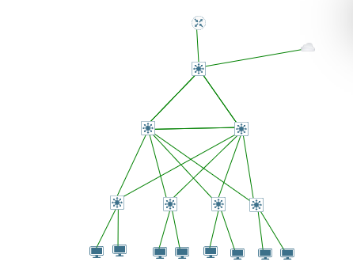
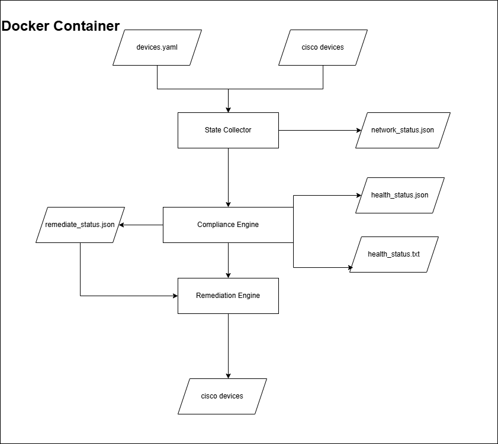

# Network Compliance Engine

## Overview

Network Compliance Engine is a Python-based network compliance and auto-remediation platform developed and tested on an enterprise-style Cisco IOS campus network built in EVE-NG.

The platform continuously collects live device state, compares it against a desired-state configuration, detects configuration drift, generates compliance reports, and automatically remediates supported configuration deviations.

The application is containerized using Docker and Docker Compose for simplified deployment and operation.

---

## Lab Topology



### Topology Components

* 1 ISP Router
* 1 Core Switch
* 2 Distribution Switches
* 4 Access Switches
* 8 End Hosts
* Management bridge for automation host connectivity

The topology follows a hierarchical enterprise campus design with redundant uplinks between the Core, Distribution, and Access layers.

---

## Architecture



### Compliance Workflow

1. Desired network state is defined in `devices.yaml`
2. State Collector gathers operational data from Cisco IOS devices
3. Compliance Engine compares actual state against the desired state
4. Health reports are generated
5. Remediation commands are generated
6. Remediation Engine applies corrective actions
7. Compliance monitoring continues continuously

---

## Features

### Desired State Management

* YAML-based desired-state definitions
* Jinja2-based configuration generation
* Automated green-state configuration generation

### State Collection

* Multithreaded device polling
* Cisco IOS support through Netmiko
* Structured JSON network state storage

### Compliance Validation

Supported compliance domains:

* VLANs
* Interfaces
* DHCP
* OSPF
* HSRP
* EtherChannel

### Reporting

* JSON health reports
* Text-based health reports
* Historical report snapshots
* Structured application logging

### Automated Remediation

* Automatic remediation command generation
* Automatic remediation deployment
* Unique drift identification
* Remediation attempt tracking
* Failed-remediation suppression

### Deployment

* Docker containerization
* Docker Compose deployment
* Persistent volume storage

---

## Desired State Generation

The project includes a Jinja2-based configuration generation system used to create green-state Cisco IOS configurations.

### Workflow

```text
devices.yaml
      +
Jinja2 Templates
      ↓
Green-State Configurations
```

Generated configurations represent the intended network state used by the compliance engine.

---

## Project Structure

```text
network-compliance-engine/
│
├── config/
├── device_run_configs/
├── docs/
│   ├── topology.png
│   └── architecture.png
│
├── drifts/
├── remediation/
├── templates/
│
├── eve-ng/
│   └── Enterprise_Campus_Automation.unl
│
├── health_status/
├── network_status/
├── remediate_status/
│
├── auto_config_save.py
├── config_gen.py
├── main.py
├── network_status_collector.py
├── network_report_and_remediator_generator.py
├── network_remediator.py
│
├── devices.example.yaml
├── Dockerfile
├── docker-compose.yml
├── requirements.txt
├── .gitignore
└── README.md
```

---

## Technologies Used

* Python
* Netmiko
* Jinja2
* YAML
* Docker
* Docker Compose
* Cisco IOS
* EVE-NG
* Linux

---

## Running the Project

### Configure Devices

Create a devices file from the example configuration:

```bash
cp devices.example.yaml devices.yaml
```

Populate the file with device addresses and credentials.

### Start

```bash
docker compose up -d
```

### View Logs

```bash
docker compose logs -f
```

### Stop

```bash
docker compose down
```

---

## Example Compliance Cycle

1. A VLAN is removed from a switch.
2. State Collector detects the change.
3. Compliance Engine identifies the configuration drift.
4. Health reports are generated.
5. Remediation commands are generated automatically.
6. Remediation Engine restores the missing configuration.
7. The device returns to the desired state.

---

## EVE-NG Lab

The repository includes the EVE-NG topology file used during development and testing.

Required images:

* Cisco IOSv
* Cisco IOSvL2

Import the included `.unl` file into EVE-NG and map the required images.

---

## Future Improvements

* Multi-vendor device support
* Policy-based remediation approval workflows
* Alerting integrations
* Configuration version tracking
* Web-based monitoring dashboard
